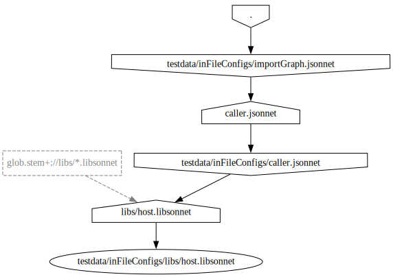

# Jsonnet Custom-Importers

[](https://pkg.go.dev/github.com/peterbueschel/jsonnet-custom-importers)
[](https://goreportcard.com/report/github.com/peterbueschel/jsonnet-custom-importers)
[](https://coveralls.io/github/peterbueschel/jsonnet-custom-importers?branch=main)

- Extend the jsonnet `import` and `importstr` functions with the help of custom importers.
- Choose either a specific importer or use the `NewMultiImporter()` function to enable all together. The prefix of an import path will route to the right importer. As a fallback the default [go-jsonnet](https://github.com/google/go-jsonnet) `FileImporter` will be used.
- A custom importer can be set for a [jsonnet VM](https://pkg.go.dev/github.com/google/go-jsonnet?utm_source=godoc#VM) like:

```go
import (
    ...
	importer "github.com/peterbueschel/jsonnet-custom-importers"
)
...
    
    m := importer.NewMultiImporter()
    vm := jsonnet.MakeVM()
    vm.Importer(m)
```

---

## Custom Importers

The main idea is to add a kind of *[intrinsic functionality](https://en.wikipedia.org/wiki/Intrinsic_function)* into the **import path string** by adding extra content. The custom importers can parse these extra content and act on them.

The pattern for the import path is based on [URLs](https://pkg.go.dev/net/url#URL)

- url:

```txt
[scheme:][//[userinfo@]host][/]path[?query][#fragment]
```

- import pattern:

```jsonnet
import '[<importer-prefix>://][<glob-pattern>|<filepath>][?<query-parameters>]'
```

<details>
  <summary>Example patterns</summary>


#### Original [go-jsonnet](https://github.com/google/go-jsonnet/blob/master/imports.go#L219) FileImporter

```jsonnet
import 'example.jsonnet'
```

where the `[<importer-prefix>://]` is empty and the `<filepath>` is `example.jsonnet`

#### Custom GlobImporter

```jsonnet
import 'glob.stem+://**/*.jsonnet'
```

where `glob.stem+` is the `<importer-prefix>` and the `<glob-pattern>` is `**/*.jsonnet`.

#### Custom GlobImporter With Query-Parameter

```jsonnet
import 'glob.stem+://**/*.jsonnet?exclude=**/*ignore.*'
```

same as before but in addition with the `<query-parameter>` `exclude=**/*ignore.*`.

</details>


### List of available custom importers with the supported prefixa and available query-parameters

| Name            | `<importer-prefix>` in `import` path  | `<importer-prefix>` in `importstr` path      | `<query-parameters>`                               |
| ----            | ---                                   | ---                                          | -----                                              |
| `MultiImporter` | any - will address the right importer | any                                          | `logLevel=<info\|debug>`, `importGraph=<filepath>`, `onMissingFile=<filepath\|content>` |
| `GlobImporter`  | `glob.<?>`, `glob.<?>+`, `glob+`      | `glob-str.<?>`, `glob-str.<?>+`, `glob-str+` | `logLevel=<info\|debug>`, `exclude=<glob-pattern>` |

---

## MultiImporter

- This importer **includes all custom importers** and as fallback the default [go-jsonnet](https://github.com/google/go-jsonnet) `FileImporter`. The *MultiImporter* tries to find the right custom importer with the help of the `<importer prefix>`. If it found one, the import string will be forwarded to this custom importer, which in turn takes care of the string.
- Optionally, custom importers can be chosen via: 

``` go
  m := NewMultiImporter(NewGlobImporter(), NewFallbackFileImporter())
```

## GlobImporter

- Is a custom importer, which:
	- **Imports multiple files at once** via [glob patterns](https://en.wikipedia.org/wiki/Glob_(programming)) handled by the [doublestar](https://github.com/bmatcuk/doublestar) library.
	- Supports **Continuous** imports: If inside the resolved files other glob-patterns will be found, the *GlobImporter* will also take these *glob-imports* and resolves the underlying files.
	- Can **Exclude** imports: use `exclude=<glob pattern>` as query parameter to exclude files from further handlings.
    - Supports extra **JPaths**: extra search paths for additional libraries. (⚠️ matches of library paths have a lower priority then matches in the current work dir)
    - **Sorts** the resolved files: in lexicographical and hierarchical order. Example: `[a0 b02 a0/b/c a1 d/x c b2 a1/b b10]` becomes `[a0 a0/b/c a1 a1/b b02 b10 b2 c d/x]` 
- Activate the _glob-import_ via the prefix `glob.<?>` or `glob.<?>+` to get the content of the resolved files as object. The content of each file will be available under its resolved **path**, **file**name, **stem** (filename with file extension) or **dir**name. (see also table in section "Prefix `glob.<?>` And `glob.<?>+`")
- Use the prefix `glob+` to merge the returned imports. (similar to the jsonnet `+:` functionality)


### Examples

(More examples can be found in the [testings](testings.md) file.)

Folder structure:

``` console
models
├── blackbox_exporter.json
├── blackbox_exporter.libsonnet
├── node_exporter.json
├── node_exporter.libsonnet
├── development
│   └── grafana.libsonnet
├── production
│   ├── victor_ops.libsonnet
│   └── grafana.libsonnet
└── wavefront.libsonnet
```


<details>
  <summary><h4>Prefix `glob.&lt;?&gt;` And `glob.&lt;?&gt;+`</h4></summary>

- Each resolved file, which matched the glob pattern, will be handled individually and will be available in the code under a specific variable name. The variable name can be specified in the `<?>` part.
- `<?>` can be one of the following options:
  
  | option       | example result   |
  |--------------|------------------|
  | `path`       | `/foo/bar/baa.jsonnet` |
  | `file`      | `baa.jsonnet`        |
  | `stem`       | `baa`             |
  | `dir`        | `/foo/bar/`        |

- ⚠️ On colliding `file`|`stem`|`dir` -names, only the last resolved result in the hierarchy will be used. Use the `glob.<?>+` (extra `+`) prefix to merge colliding names instead. The imports will be merged in hierarchical and lexicographical order similar to `glob+`. (also note: `glob.path` and `glob.path+` are the same)

##### Example Input `glob.path`

``` jsonnet
import 'glob://models/**/*.libsonnet';
```

##### Example Result `glob.path`

Code which will be evaluated in jsonnet:
``` jsonnet
 {
   'models/blackbox_exporter.libsonnet': import 'models/blackbox_exporter.libsonnet',
   'models/node_exporter.libsonnet': import 'models/node_exporter.libsonnet',
   'models/wavefront.libsonnet': import 'models/wavefront.libsonnet',
   'models/development/grafana.libsonnet': import 'models/development/grafana.libsonnet',
   'models/production/grafana.libsonnet': import 'models/production/grafana.libsonnet',
   'models/production/victor_ops.libsonnet': import 'models/production/victor_ops.libsonnet',
 }
```

##### Example Input `glob.stem`

```jsonnet
import 'glob.stem://models/**/*.libsonnet'
```

##### Example Result `glob.stem`

Code which will be evaluated in jsonnet:
``` jsonnet
  {
    blackbox_exporter: import 'models/blackbox_exporter.libsonnet',
    node_exporter: import 'models/node_exporter.libsonnet',
    wavefront: import 'models/wavefront.libsonnet',
    grafana: import 'models/production/grafana.libsonnet',
    victor_ops: import 'models/production/victor_ops.libsonnet',
  }
```

##### Example Input `glob.stem+`

```jsonnet
import 'glob.stem+://models/**/*.libsonnet'
```

##### Example Result `glob.stem+`

Code which will be evaluated in jsonnet:
```jsonnet
 {
   blackbox_exporter: import 'models/blackbox_exporter.libsonnet',
   node_exporter: import 'models/node_exporter.libsonnet',
   wavefront: import 'models/wavefront.libsonnet',
   grafana: (import 'models/development/grafana.libsonnet') + (import 'models/production/grafana.libsonnet'),
   victor_ops: import 'models/production/victor_ops.libsonnet',
 }
```

</details>


<details>
  <summary><h4>Prefix `glob+`</h4></summary>


These files will be merged in the hierarchical and lexicographical order.

##### Example Input

``` jsonnet
import 'glob+://models/**/*.libsonnet'
```

#### Example Result

Code which will be evaluated in jsonnet:
``` jsonnet
(import 'models/blackbox_exporter.libsonnet') +
(import 'models/node_exporter.libsonnet') +
(import 'models/wavefront.libsonnet') +
(import 'models/sub-folder-2/grafana.libsonnet')
```

</details>


## Options

### Logging

Enable/add a [zap.Logger](https://github.com/uber-go/zap) via `<Importer>.Logger()` **per importer** or just use the this method on the `MultiImporter` instance to enable this of all underlying custom importers.


<details>
  <summary><h4>details</h4></summary>

```go
import (
  ...
  "go.uber.org/zap"
)
...
l := zap.Must(zap.NewDevelopment()) // or use zap.NewProduction() to avoid debug messages
m := NewMultiImporter()
m.Logger(l)
...
```

**(update since v0.0.3-alpha)** Another option is to use the special *config* import inside an `jsonnet` file:

```jsonnet
// set the logLevel
local importers = import 'config://set?logLevel=debug';

// enable it for example via:
local myother_imports = importers + (import 'somethingElse.jsonnet');
...
```

</details>


### Aliases

Add an alias for an importer prefix.


<details>
  <summary><h4>details</h4></summary>

```go
 g := NewGlobImporter()
 if err := g.SetAliasPrefix("glob", "glob.stem+"); err != nil {
   return err
 }
 m := NewMultiImporter(g)
```

The `SetAliasPrefix()` can be used multiple times, whereby only the last setting for an alias-prefix pair will be used.

</details>


### Import Graph

The `MultiImporter` can detect [import cycles](https://en.wikipedia.org/wiki/Circular_dependency)
and creates an *import graph* in [dot](https://www.graphviz.org/documentation/) format once it found a cycle.


<details>
  <summary><h4>details</h4></summary>

In addition such *import graphs* can also be enable independently via the special *config* import inside an `jsonnet` file:

```jsonnet
// set the import graph file name
local importers = import 'config://set?importGraph=import_graph.gv';

// enable the file creation:
local myother_imports = importers + (import 'somethingElse.jsonnet');
...
```

Example image from [testdata/inFileConfigs/importGraph.jsonnet](testdata/inFileConfigs/importGraph.jsonnet):



> the image was created via `dot -Tsvg -O graph.gv` command (ref. [graphviz cli tool](https://graphviz.org/doc/info/command.html))

</details>

### Ignore Import Cycles

To disable the tests and therefore any error handling for *import cycles*, you can use the following config in your *jsonnet* code.

<details>
  <summary><h4>details</h4></summary>

```jsonnet
// set the import graph file name
local importers = import 'config://set?ignoreImportCycles';

// enable the file creation:
local myother_imports = importers + (import 'somethingElse.jsonnet');
...
```

Or directly in your go code via:

```go
 m := NewMultiImporter(g)
 m.IgnoreImportCycles()
```

</details>

### Handling Of Missing Files

**(new in v0.0.6-alpha)** (see #9)

With that option you can specify a fallback to another file or a concrete content/string, if the file in the import couldn't be found.

<details>
  <summary><h4>details</h4></summary>

#### Inside the **jsonnet** code - with content:

```jsonnet
// set a predefined file content
local importers = import 'config://set?onMissingFile="{}"';
local myother_imports = importers + (import 'possiblyMissingFile.jsonnet');
```

#### Inside the **jsonnet** code - with a different file:

```jsonnet
// set a replacement file
local importers = import 'config://set?onMissingFile=default.jsonnet';
local myother_imports = importers + (import 'possiblyMissingFile.jsonnet');
```

#### Inside the **go** code - with content:

```go
m := NewMultiImporter()
m.OnMissingFile("'{}'") // single qoutes marks a content
```
#### Inside the **go** code - with a different file:

```go
m := NewMultiImporter()
m.OnMissingFile('default.jsonnet')
```

> A more complex example can also be found in [testdata/inFileConfigs/onMissingFile_multi.jsonnet](testdata/inFileConfigs/onMissingFile_multi.jsonnet)

</details>


## Dependencies

- https://github.com/google/go-jsonnet the reason for everything :-)
- https://github.com/bmatcuk/doublestar support for double star (`**`) glob patterns
- https://github.com/uber-go/zap for structured logging
- https://github.com/dominikbraun/graph to check for import cycles and generate import graphs

## Other Projects

- another glob–importer https://qbec.io/reference/jsonnet-glob-importer/
	- example usage https://github.com/splunk/qbec/blob/main/vm/internal/importers/glob_test.go#L32

## Follow-Up Tasks

- [X] **importstr**: add support for `importstr`
- [X] **Ignore paths**: add support in the GlobImporter for ignore paths
- [X] **Alias**: add a prefix to a custom importer via `<Importer>.AddPrefix(string)`
- [ ] **HTTP** support: loads single files per url
- [ ] **Git** support: loads files in branches from repositories
